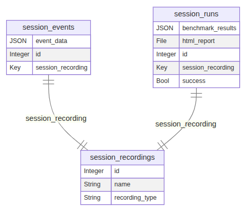

# record-and-rerun
This plugin allows you to record user interactions (navigations, clicks and keypresses) on a page, store them in the database and rerun them later using the playwright framework. This way you can easily create automated tests (*or benchmarks*) based on real user interactions.
## System requirements
This plugin requires **Playwright** on your server.  
Playwright needs several system libraries that must be installed with `sudo`.

While configuring the plugin, you will see a button *Install Playwright*, but this only works if all dependencies are fulfilled. 
You can ensure this by running:

    sudo npx playwright install-deps

and click the button. Or alternatively, install everything on your own:

    sudo npx playwright install-deps
    npx playwright install
## Plugin configuration
In the plugin configuration you have an option to set up the standard Tables, Views and Actions. 
### Database schema
The table-schema looks like this:

* **session_recordings**: For each recorded session you get a row in `session_recordings` with the name and session type (web or mobile)  
  *Note: mobile support is still experimental.*
* **session_events**: The actual events are stored in `session_events` in a JSON field.
* **session_runs:**: When you do a rerun (or benchmark), a row in `session_runs` is created. Important fields:
  - success: `Boolean` field indicating if the run was successful
  - html-report: `File` field storing the HTML report generated by Playwright
  - benchmark_results: `JSON` field storing the benchmark results if was a benchmark run

### Views
The following views are created:

* **Sessions Recorder**: View to start or stop recording sessions.  
  When you start a recording, the current user is logged out and redirected to `/`.  
  Make sure the user who initiates the recording has an **API token** configured.  
  This token is used to upload the recorded events, and it works even if the user being recorded (after the logout) does **not** have access rights to the `session_events` table.
* **Sessions List**: This view lists all recorded sessions and provides buttons to either rerun a session or run a benchmark.  
  The rerun button triggers the `rerun_user_workflow` action, while the benchmark button uses the `benchmark_user_workflow` action.
* **Session Events List**: In this view you can see the recorded events as JSON data.
* **Session Runs List**: Shows the results of a rerun (HTML report and success flag).
* **Session Benchmark Runs List**: Shows the results of a benchmark run (benchmark results as JSON and success flag).

